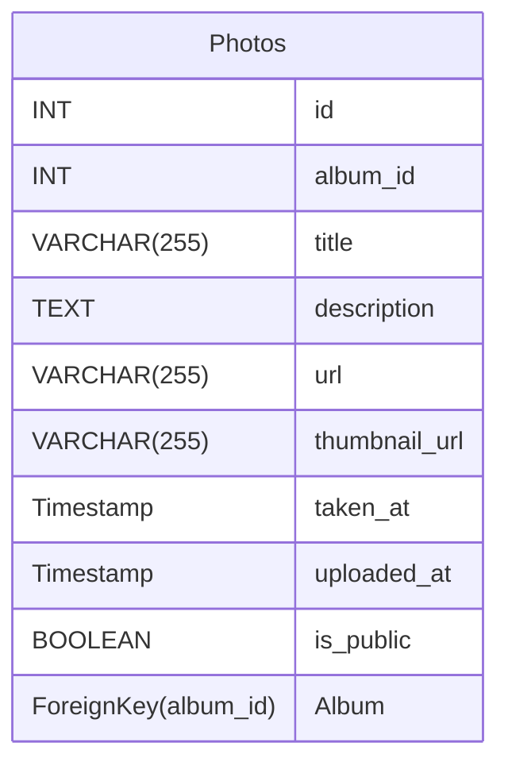

#### photo_id SERIAL PRIMARY KEY,
#### album_id INT NOT NULL,
#### photo_title VARCHAR(255) NOT NULL,
#### photo_description TEXT,
#### photo_url VARCHAR(255) NOT NULL,
#### thumbnail_url VARCHAR(255) NOT NULL,
#### taken_at TIMESTAMP WITH TIME ZONE,
#### uploaded_at TIMESTAMP WITH TIME ZONE DEFAULT CURRENT_TIMESTAMP,
#### is_public BOOLEAN DEFAULT FALSE,
#### FOREIGN KEY (album_id) REFERENCES [[Album]](album_id
