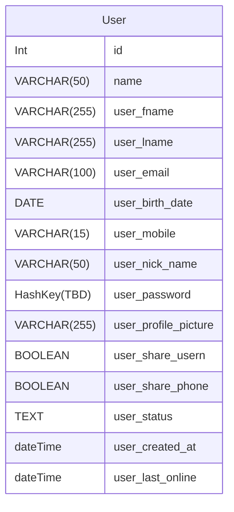

#### user_id SERIAL PRIMARY KEY,
#### user_name VARCHAR(50),

#### user_fname VARCHAR(50),
#### user_lname VARCHAR(50),

#### user_email VARCHAR(100) UNIQUE NOT NULL,
#### user_birth_date DATE,

#### user_mobile VARCHAR(15), 

#### user_nick_name VARCHAR(50), 

##### user_password HashKey(TBD)

##### user_profile_picture VARCHAR(255), -- URL to the image stored on S3.

#### user_share_usern BOOLEAN NOT NULL DEFAULT false, 

#### user_share_phone BOOLEAN NOT NULL DEFAULT false
#### user_status (text) To set a status message
#### user_created_at (dateTime)

#### user_last_online (dateTime)

#### privacy_settings

